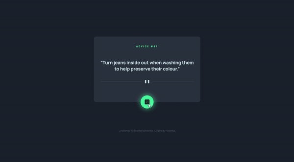
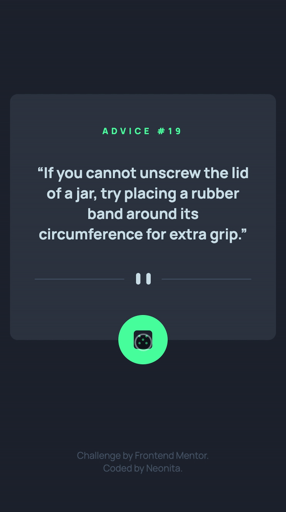

# Frontend Mentor - Advice generator app solution

This is a solution to the [Advice generator app challenge on Frontend Mentor](https://www.frontendmentor.io/challenges/advice-generator-app-QdUG-13db). Frontend Mentor challenges help you improve your coding skills by building realistic projects.

## Table of contents

- [Overview](#overview)
  - [The challenge](#the-challenge)
  - [Screenshot](#screenshot)
  - [Links](#links)
  - [Built with](#built-with)
- [Author](#author)

## Overview

### The challenge

Users should be able to:

- View the optimal layout for the app depending on their device's screen size
- See hover states for all interactive elements on the page
- Generate a new piece of advice by clicking the dice icon

### Screenshot

<small style="color:grey">Screen recording of desktop resolution</small>

<small style="color:grey">Screen recording of mobile resolution</small>

### Links

- Solution URL: [Repository](https://github.com/neonita/Frontend-Mentor/tree/main/Junior/advice-generator-app-main)
- Live Site URL: [Live](https://neonita.github.io/Frontend-Mentor/Junior/advice-generator-app-main/)

### Built with

- Semantic HTML5 markup
- CSS custom properties
- Flexbox
- Mobile-first workflow
- [Axios](https://axios-http.com/) - A simple promise based HTTP client for the browser and node.js

## Author

- GitHub - [Neonita](https://github.com/neonita)
