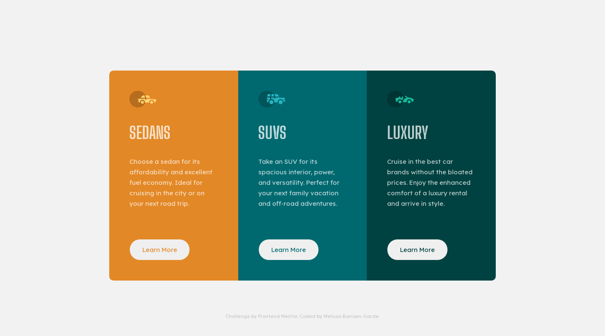
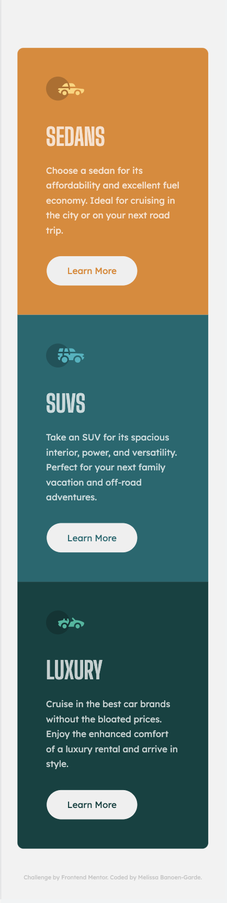

# Frontend Mentor - 3-column preview card component solution

This is a solution to the [3-column preview card component challenge on Frontend Mentor](https://www.frontendmentor.io/challenges/3column-preview-card-component-pH92eAR2-). Frontend Mentor challenges help you improve your coding skills by building realistic projects.

## Table of contents

- [Overview](#overview)
  - [The challenge](#the-challenge)
  - [Screenshot](#screenshot)
  - [Links](#links)
- [My process](#my-process)
  - [Built with](#built-with)
  - [What I learned](#what-i-learned)
  - [Continued development](#continued-development)
  - [Useful resources](#useful-resources)
- [Author](#author)
- [Acknowledgments](#acknowledgments)

## Overview

### The challenge

Users should be able to:

- View the optimal layout depending on their device's screen size
- See hover states for interactive elements

### Screenshot

  <div align="center">
   
  <small>Desktop result — Design image</small> <br>
 <br>
   
 <br>
  <small>Mobile result — Design image</small> <br>
</div>

### Links

- Solution URL: [Repository](https://github.com/neonita/Frontend-Mentor/tree/main/Newbie/3-column-preview-card-component-main)
- Live Site URL: [Live Demo](https://neonita.github.io/Frontend-Mentor/Newbie/3-column-preview-card-component-main/)

## My process

- Plan and draw the layout by breaking the website down into elements. Jot down class names I might find to be useful.
 <div align="center">
   
  <br>
  <small>configuring the layout, if containers are needed, etc. also, i'm sorry for the bad handwriting, I'm still learning how to write comfortably on a tablet. :) </small> 
</div>
<br>

- Add HTML and classes by applying the BEM method. You can read about BEM [here](http://getbem.com/introduction/).
- Style the markups. I styled mobile last but thinking about trying mobile-first.
- Eyeball whether final results match the provided desktop and mobile design.

### Built with

- Semantic HTML5 markup
- CSS custom properties
- Flexbox
- CSS Grid

### What I learned

I learned how to center a component on the page without it being affected by the footer, using CSS `position` and `z-index` properties.

```html
<body>
  <main class="grid">[...]</main>
  <footer class="footer">[...]</footer>
</body>
```

```css
body {
  display: flex;
  flex-direction: column;
  justify-content: center;
  align-items: center;
  height: 100vh;
}

.grid {
  position: relative;
  top: 0px;
  left: 0px;
  z-index: 0;
}

.footer {
  position: absolute;
  bottom: 5%;
  z-index: 1;
}
```

### Useful resources

- [CSS z-index Property](https://www.w3schools.com/cssref/pr_pos_z-index.asp) - This helped me better understand how to properly implement the `z-index` property in CSS.

## Author

- GitHub - [@neonita](https://github.com/neonita)
