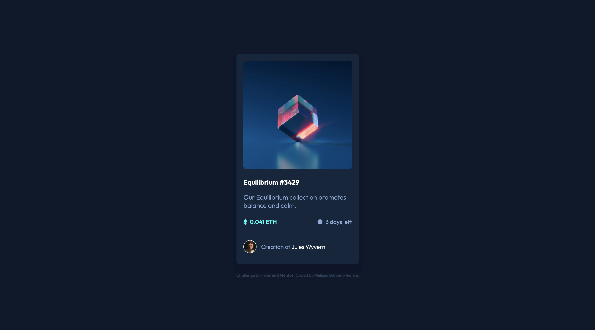
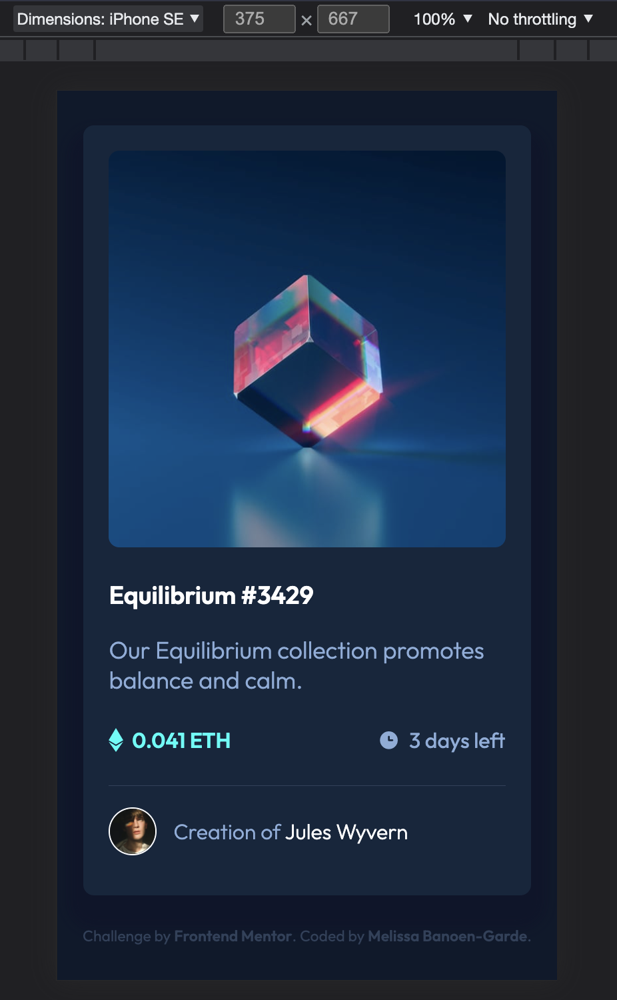

# NFT preview card component

## Table of contents

- [Overview](#overview)
  - [The challenge](#the-challenge)
  - [Screenshot](#screenshot)
  - [Links](#links)
  - [Built with](#built-with)
  - [Useful resources](#useful-resources)

## Overview

This is a [challenge](https://www.frontendmentor.io/challenges/nft-preview-card-component-SbdUL_w0U) by [Frontend Mentor](https://www.frontendmentor.io/home)

### The challenge

Users should be able to:

- View the optimal layout depending on their device's screen size
- See hover states for interactive elements

### Screenshot

;

### Links

- Solution: [Repository](https://github.com/neonita/Frontend-Mentor/tree/main/Newbie/nft-preview-card-component-main)
- Live Site: [Live Demo](https://neonita.github.io/Frontend-Mentor/Newbie/nft-preview-card-component-main/index.html)

### Built with

- Semantic HTML5 markup
- CSS custom properties
- Flexbox

### Useful resources

- [Flex](https://flexbox.malven.co/)
