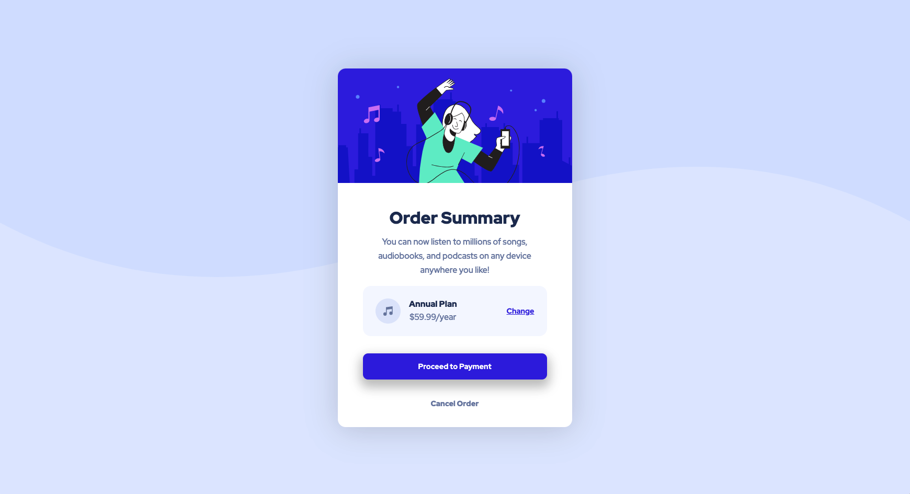

# Order summary card

This is a solution to the [Order summary card challenge on Frontend Mentor](https://www.frontendmentor.io/challenges/order-summary-component-QlPmajDUj). Frontend Mentor challenges help you improve your coding skills by building realistic projects.

## Table of contents

- [Overview](#overview)
  - [Screenshot](#screenshot)
  - [The challenge](#the-challenge)
  - [Links](#links)
- [My process](#my-process)
  - [Built with](#built-with)
  - [What I learned](#what-i-learned)
- [Author](#author)

## Overview

### Screenshot

Desktop

### The challenge

Users should be able to:

- See hover states for interactive elements

### Links

- Solution URL: [Repository](https://github.com/neonita/Frontend-Mentor/tree/main/Newbie/order-summary-component-main)
- Live Site URL: [Live Demo](https://neonita.github.io/Frontend-Mentor/Newbie/order-summary-component-main/index.html)

## My process

### Built with

- Semantic HTML5 markup
- CSS custom properties
- Flexbox
- CSS Grid

### What I learned

## Author

- Frontend Mentor - [@neonita](https://www.frontendmentor.io/profile/neonita)
