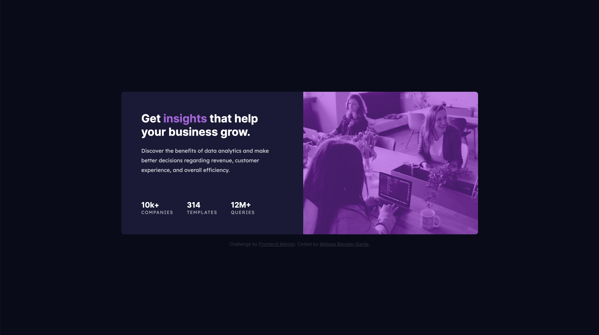
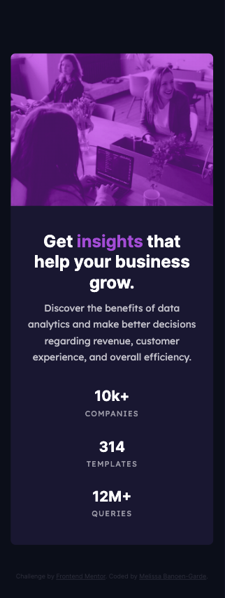

# Frontend Mentor - Stats preview card component solution

This is a solution to the [Stats preview card component challenge on Frontend Mentor](https://www.frontendmentor.io/challenges/stats-preview-card-component-8JqbgoU62). Frontend Mentor challenges help you improve your coding skills by building realistic projects.

## Table of contents

- [Overview](#overview)
  - [The challenge](#the-challenge)
  - [Screenshot](#screenshot)
  - [Links](#links)
- [My process](#my-process)
  - [Built with](#built-with)
  - [What I learned](#what-i-learned)
  - [Continued development](#continued-development)
  - [Useful resources](#useful-resources)
- [Author](#author)

## Overview

### The challenge

Users should be able to:

- View the optimal layout depending on their device's screen size

### Screenshot

  <div align="center">
   
  <small>Desktop result — Design image</small> <br>
 <br>
   
 <br>
  <small>Mobile result — Design image</small> <br>
</div>

### Links

- Solution URL: [Repository](https://github.com/neonita/Frontend-Mentor/tree/main/Newbie/stats-preview-card-component-main)
- Live Site URL: [Live Demo](https://neonita.github.io/Frontend-Mentor/Newbie/stats-preview-card-component-main/)

## My process

### Built with

- Semantic HTML5 markup
- CSS custom properties
- Flexbox
- CSS Grid

### What I learned

In this challenge, I spent the most time figuring out how to apply a color overlay above an image. I saw there were many methods but I prefered adding the image and tint in CSS.

To see how you can add code snippets, see below:

```html
<!-- HTML -->
<div class="card__cell card__cell-right">
  <div class="cell-right__img"></div>
</div>
```

```css
/* CSS */
.cell-right__img {
  width: 100%;
  height: 400px;

  background-image: linear-gradient(
      var(--img-color-tint),
      var(--img-color-tint)
    ), url("/images/image-header-desktop.jpg");
  background-size: 100% 400px;
  border-top-right-radius: var(--radius);
  border-bottom-right-radius: var(--radius);
  mix-blend-mode: lighten;
  filter: contrast(130%);
}
```

### Continued development

Continue practicing responsive web development:

- gauging whether to use CSS Flexbox or grid,
- knowing when to use absolute and relative units,
- assessing if an element on mobile design fits in a viewport height or is scrollable, etc.

### Useful resources

- [Creating Image Overlays with CSS Multiple Backgrounds](https://spin.atomicobject.com/2015/04/07/css-multiple-backgrounds/) - This helped me understand how to apply a color-overlay above an image.
<!-- - [Example resource 2](https://www.example.com) - This is an amazing article which helped me finally understand XYZ. I'd recommend it to anyone still learning this concept. -->

## Author

[@neonita](https://github.com/neonita)
