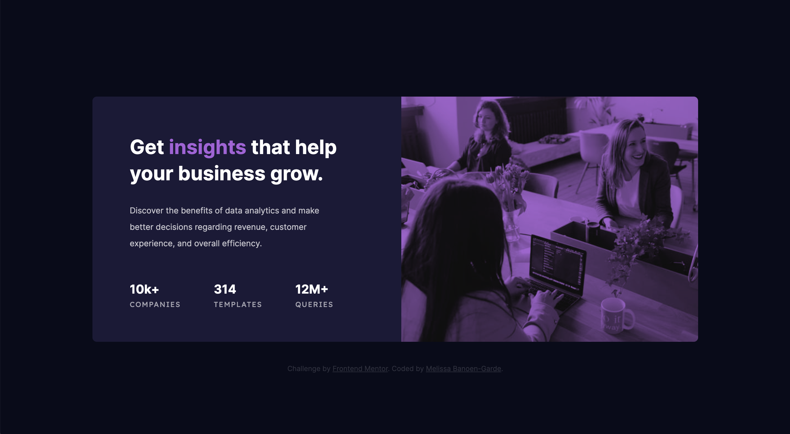
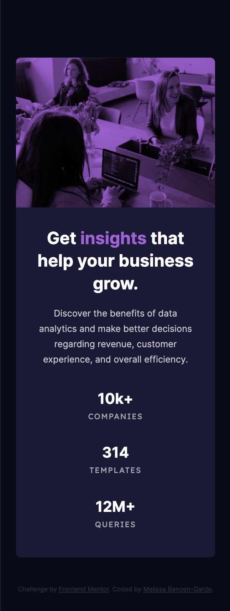

# Frontend Mentor - Stats preview card component solution

This is a solution to the [Stats preview card component challenge on Frontend Mentor](https://www.frontendmentor.io/challenges/stats-preview-card-component-8JqbgoU62). Frontend Mentor challenges help you improve your coding skills by building realistic projects.

## Table of contents

- [Overview](#overview)
  - [The challenge](#the-challenge)
  - [Screenshot](#screenshot)
  - [Links](#links)
- [My process](#my-process)
  - [Built with](#built-with)
  - [What I learned](#what-i-learned)
  - [Continued development](#continued-development)
  - [Useful resources](#useful-resources)
- [Author](#author)

## Overview

### The challenge

Users should be able to:

- View the optimal layout depending on their device's screen size

### Screenshot

  <div align="center">
   
  <small>Desktop result — Design image</small> <br>
 <br>
   
 <br>
  <small>Mobile result — Design image</small> <br>
</div>

### Links

- Solution URL: [Repository](https://github.com/neonita/Frontend-Mentor/tree/main/Newbie/stats-preview-card-component-main)
- Live Site URL: [Live Demo](https://neonita.github.io/Frontend-Mentor/Newbie/stats-preview-card-component-main/)

## My process

### Built with

- Semantic HTML5 markup
- CSS custom properties
- Flexbox
- CSS Grid

### What I learned

In this challenge, I spent most of my time figuring out how to apply a color overlay above an image. I found quite a few methods & chose to add the image and tint via CSS:

```html
<!-- HTML -->
<div class="card__cell card__cell-right">
  <div class="cell-right__img"></div>
</div>
```

```css
/* CSS */
.cell-right__img {
  width: 100%;
  height: 100%;

  background: var(--desktop-img) var(--accent-violet) 0% 0% / 100% no-repeat
    border-box border-box;
  background-blend-mode: multiply;

  border-top-right-radius: var(--radius);
  border-bottom-right-radius: var(--radius);
}
```

<br> 
Another valuable lesson I learned is to absolutely <strong>use devtools to troubleshoot an image's pathway.</strong>

### Continued development

Continue practicing responsive web development:

- gauging whether to use CSS Flexbox or grid,
- knowing when to use absolute and relative units,
- assessing if an element on mobile design fits in a viewport height or is scrollable,
- <strong>Use devtools to troubleshoot an image's pathway</strong>,
  etc.

### Useful resources

- [Creating Image Overlays with CSS Multiple Backgrounds](https://spin.atomicobject.com/2015/04/07/css-multiple-backgrounds/) - This helped me understand how to apply a color-overlay above an image.
- [Media Queries Breakpoints For Responsive Design In 2021](https://devfacts.com/media-queries-breakpoints-2021/) - An article discussing the media queries breakpoints for responsive design and its standards.
- [Make some magic with CSS blend modes](https://pawelgrzybek.com/make-some-magic-with-css-blend-modes/) - An article that helped me understand the difference between `mix-blend-mode` and `background-blend-mode`.
- [Background Shorthand](https://riptutorial.com/css/example/3595/background-shorthand) - Provides the syntax of the background shorthand declaration with all background properties.

## Author

[@neonita](https://github.com/neonita)
